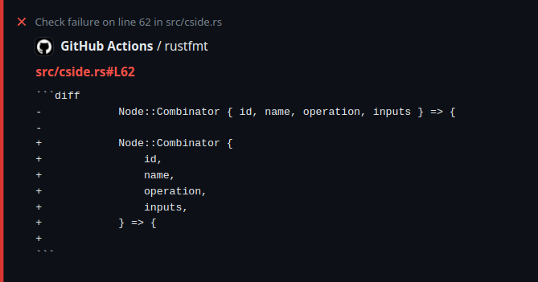

# Run `rustfmt` — Annotations fork

## About the fork

This fork makes it so that annotations include their own diff, rather than having a summary with all the diffs. At the moment, it seems that Annoations can't use GH-Flavoured Markdown, but I decided to leave the code block just in case it changes in the future.

Run `cargo fmt --all` and report all formatting differences block-by-block.
It works best in combination with [`actions-rust-lang/setup-rust-toolchain`] for [problem matcher] highlighting.

Problem Matcher:



## Example workflow

```yaml
name: "Test Suite"
on:
  push:
  pull_request:

jobs:
  formatting:
    name: cargo fmt
    runs-on: ubuntu-latest
    steps:
      - uses: actions/checkout@v3
      # Ensure rustfmt is installed and setup problem matcher
      - uses: actions-rust-lang/setup-rust-toolchain@v1
        with:
          components: rustfmt
      - name: Rustfmt Check
        uses: Syndelis/rustfmt-action@v1
        with:
          github_token: ${{ secrets.GITHUB_TOKEN }}
```

## Inputs

| Name            | Description                                                                  | Default                                            |
| --------------- | ---------------------------------------------------------------------------- | -------------------------------------------------- |
| `github_token`  | Your GitHub token with enough permissions to read repos and edit check runs. | **None**. Supply with `${{ secrets.GITHUB_TOKEN }}`|
| `manifest-path` | Path to the `Cargo.toml` file, by default in the root of the repository.     | ./Cargo.toml                                       |

If a [toolchain file](https://rust-lang.github.io/rustup/overrides.html#the-toolchain-file) (i.e., `rust-toolchain` or `rust-toolchain.toml`) is found in the root of the repository, it takes precedence over `manifest-path`.

[`actions-rust-lang/setup-rust-toolchain`]: https://github.com/actions-rust-lang/setup-rust-toolchain
[problem matcher]: https://github.com/actions/toolkit/blob/main/docs/problem-matchers.md
